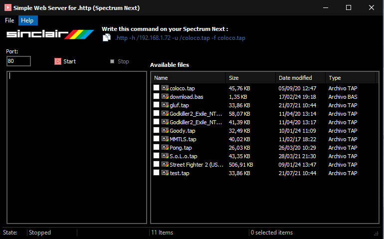

# ZxWebServer
A program to work with the .http. (remy next-http)
it's a simple web server for .http. to work with the Spectrum Next

What's new:
--------------
multiselect files
Save as (zip or Bas file) for downloading a multi files.
Fixes in the code.

What's pending?
----------------
POST from a ZX Spectrum Next a File.

How to install and use:
--------------
Copy the file Serve.exe to a folder where you have your tap, tzx, z80, sna files. 

Click on a file and it will show you the command to use on your zx spectrum Next.

Press start and the server is up, the default port is 80, you can change it if you want.

On your Spectrum next:
----------------------
Type the command that appears on top of the window. And it should download the file you want.

example: 

.http -h myip -u /pong.tap -f pong.tap

.http -h myip -u /myfiles.zip -f myfiles.zip

.http -h myip -u /myfiles.bas -f myfiles.bas

[Download server.exe here](Win32/Release/Server.exe)
